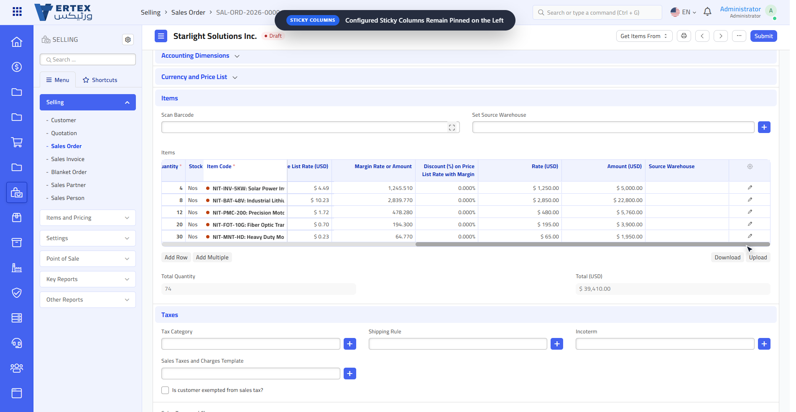
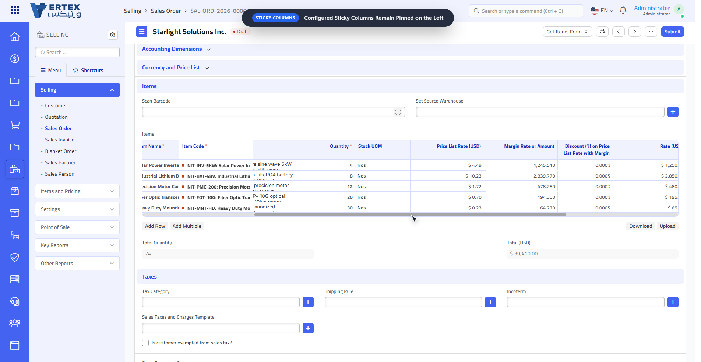

# Grid Enhancer
> **A modern grid experience for Frappe Framework (v15).**
>
> Make wide and complex child tables easier to navigate with **sticky columns, dynamic horizontal scrolling, trackpad support, a sidebar view, and a cleaner overall grid experience.**

---

## Why Grid Enhancer?

Frappe's child tables work great for normal datasets — but things get frustrating when a table contains **many columns**.

You end up scrolling horizontally, losing sight of important fields, dragging tiny scrollbars, and constantly moving back and forth just to understand the data. In **ERPNext v15**, child table grids don't ship with a proper horizontal scrollbar out of the box — **Grid Enhancer adds one**, along with a set of other UX improvements on top of the native grid.

**Grid Enhancer fixes that experience.** It enhances the existing Frappe v15 grid without requiring any changes to your existing DocTypes — just install and go.

### The goal
**Keep important information accessible while giving you the freedom to work with large, wide child tables.**

---

## Features

### Sticky Columns
Keep important columns permanently visible while horizontally scrolling through large child tables. Sticky columns stay anchored on the left while the rest of the table moves horizontally.

```text
┌──────────┬──────────┬─────────────────────────────────────────────┐
│  Item 📌 │  Qty 📌  │ Rate │ Amount │ Warehouse │ ... │ Total   │
│          │          │      │        │           │     │         │
│  Item 📌 │  Qty 📌  │ Rate │ Amount │ Warehouse │ ... │ Total   │
└──────────┴──────────┴─────────────────────────────────────────────┘
                  ←──────── horizontal scrolling ────────→
```

### Custom Horizontal Scrolling
Adds a real, usable horizontal scrollbar to child table grids — a scrollbar that Frappe v15 doesn't provide by default — plus full **two-finger trackpad scroll support**, so you're never stuck dragging a tiny native scrollbar to see the rest of a wide table.

### Sidebar View
A dedicated sidebar view for easier navigation within grids, so you can jump around large child tables without losing your place.

### Responsive Behavior
Works reliably with the sidebar open or closed and adapts across different display scaling settings — the layout stays consistent no matter how your workspace is arranged.

### Drop-in Enhancement
No changes needed to existing DocTypes. Install the app and it applies automatically to child table grid views across the site.

---

## Compatibility

Built and tested against **Frappe/ERPNext v15**. Not verified against v16 — grid internals may differ, so compatibility with v16 is not guaranteed at this time.

---

## Screenshots

**Scrolled to the right**


**Sticky Column**


---

## Installation

```bash
cd frappe-bench
bench get-app grid_enhancer https://github.com/faizy013/grid_enhancer.git
bench --site <your-site> install-app grid_enhancer
bench --site <your-site> migrate
```

## Usage

Once installed, Grid Enhancer automatically applies to child table grid views across the site — no additional configuration required.

---

## License

MIT